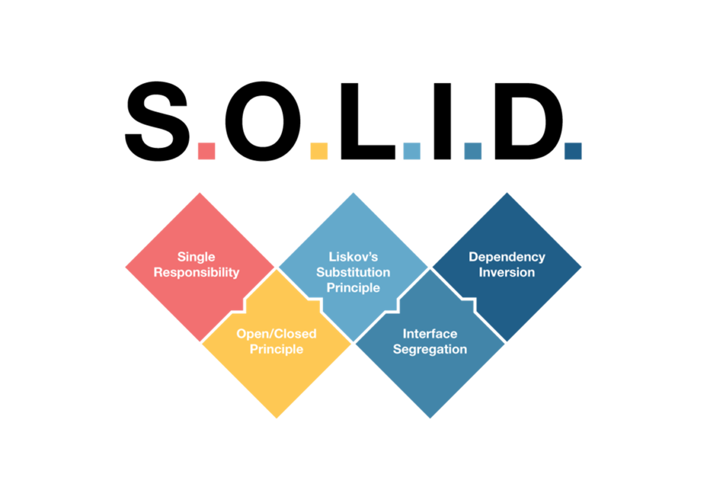
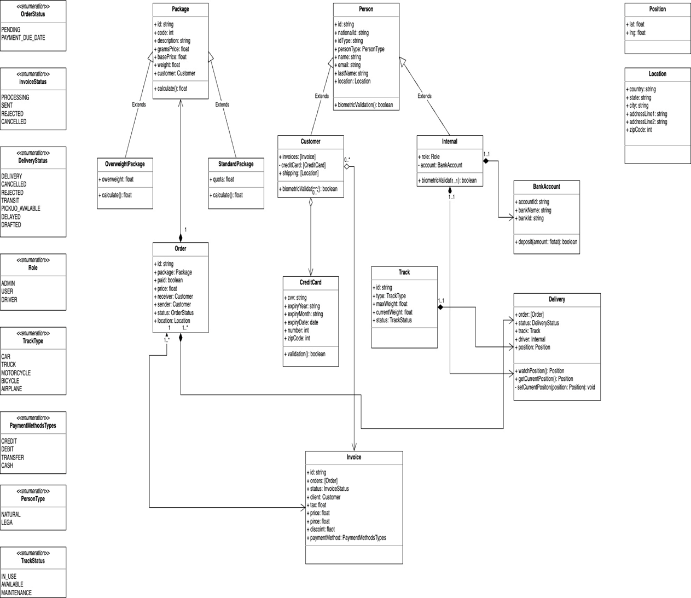

# Object Oriented Design Principles - SOLID
## SISTEMA DE GESTIÓN DE PAQUETES

En la era digital actual, la eficiencia y la transparencia en la entrega de paquetes se han convertido en factores críticos para la satisfacción del cliente y la competitividad empresarial. Empresas de logística y mensajería enfrentan el reto de manejar un volumen creciente de envíos, diversificando al mismo tiempo sus servicios para satisfacer las demandas de rapidez, costos y seguimiento preciso. Ante esta necesidad, surge el proyecto de desarrollar una aplicación web avanzada que permita a una empresa nacional de logística gestionar de manera integral los envíos de paquetes, ofreciendo soluciones escalables tanto a nivel local, nacional como internacional.

El proyecto abarcará el desarrollo de una aplicación web que soportará la creación, actualización, eliminación y clasificación de paquetes; la gestión de envíos y su trazabilidad; el registro y autenticación de usuarios; la facturación y gestión de pagos; y la búsqueda y filtrado de envíos y paquetes. La aplicación estará diseñada bajo una arquitectura orientada a objetos e incluirá una interfaz de usuario accesible y eficiente para la interacción con clientes y administradores.

Por lo tanto, los usuarios podrán registrar nuevos paquetes en el sistema, especificando características como dimensiones, peso y tipo (básico, estándar, dimensionado). La información de los paquetes podrá ser actualizada o eliminada según sea necesario, permitiendo flexibilidad y control en la gestión de envíos. Los paquetes se clasificarán automáticamente según sus características en tres categorías: básico, estándar y dimensionado. Esta clasificación ayudará en la determinación de costos de envío y en la optimización de los recursos de transporte y almacenamiento.

De igual manera, los usuarios podrán crear envíos, asignando paquetes a destinatarios específicos con direcciones detalladas. El sistema proporcionará información de trazabilidad, permitiendo a los usuarios seguir el progreso del envío desde la recolección hasta la entrega. La aplicación debe soportará el registro de diferentes tipos de usuarios, incluidos clientes y administradores. El proceso de autenticación garantizará que solo los usuarios autorizados puedan acceder a sus respectivas funcionalidades.

Finalmente, el sistema debe implementar un módulo para la generación de facturas basadas en los servicios de envío utilizados. Los usuarios podrán realizar pagos a través de métodos seguros integrados en la plataforma. Además, se debe facilitar la gestión de envíos y paquetes, la aplicación incluirá opciones avanzadas de búsqueda y filtrado. Los usuarios podrán encontrar rápidamente información específica basada en criterios como fecha de envío, estado del paquete, destinatario, entre otros.

## Single Responsibility Principle (Principio de Responsabilidad Única)
- Cada clase en la aplicación debe tener una sola razón para cambiar.
- Separa la lógica de negocio de la interfaz de usuario y la persistencia de datos.
- Puedes tener clases específicas para la
  - gestión de paquetes (PackageManagement)
  - gestión de usuarios (UserManagement)
  - gestión de envíos (ShippingManagement).
- Esto asegura que si la lógica de cómo se gestionan los paquetes cambia, no afecta a la autenticación de usuarios o al manejo de la interfaz de usuario.

## Open/Closed Principle (Principio de Abierto/Cerrado)

- Las entidades de software (clases, módulos, funciones, etc.) deben estar abiertas para la extensión, pero cerradas para la modificación.
  - Por ejemplo, si quieres añadir un nuevo tipo de clasificación de paquete o un nuevo método de pago, deberías poder hacerlo sin modificar el código existente.
- Esto se puede lograr mediante el uso de interfaces o clases abstractas.
  - Por ejemplo, una interfaz IPackageClassification permite añadir nuevas clasificaciones de paquetes sin alterar el sistema de gestión de paquetes existente.

# Substitution Principle (Principio de Sustitución de Liskov)

- Los objetos de una clase base deben poder ser sustituidos por objetos de clases derivadas sin alterar la correcta ejecución del programa.
- Asegúrate de que las subclases de entidades como User (por ejemplo, Customer y Administrator) puedan ser utilizadas a través de referencias a User sin alterar el comportamiento esperado.
- Es crucial para la autenticación y gestión de permisos en el sistema.

## Interface Segregation Principle (Principio de Segregación de Interfaces)

- Los clientes no deben ser forzados a depender de interfaces que no usan. En el contexto de tu aplicación, esto podría significar separar las interfaces grandes en interfaces más específicas y pequeñas.
- Por ejemplo, en lugar de tener una única interfaz IUserActions que incluya métodos para gestionar paquetes, envíos, y facturación, podrías tener interfaces separadas como:
  - IPackageManagement
  - IShippingManagement
  - IBillingManagement
- Para que los diferentes tipos de usuarios (clientes, administradores) solo tengan que interactuar con las interfaces relevantes para sus necesidades.

## Dependency Inversion Principle (Principio de Inversión de Dependencias)

- Los módulos de alto nivel no deben depender de módulos de bajo nivel, ambos deben depender de abstracciones.
- Las abstracciones no deben depender de los detalles; los detalles deben depender de las abstracciones.
  - Por ejemplo, que tu lógica de negocio (alto nivel) no debe depender directamente de la implementación de la base de datos (bajo nivel).
- En su lugar, utiliza interfaces o clases abstractas para definir cómo se debe acceder a los datos (IDataRepository), y luego implementa esta interfaz con clases específicas para diferentes fuentes de datos (SqlDataRepository, NoSqlDataRepository).

